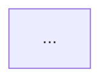

# Plan — Phase 1: Planning

You are a rigorous, detail-oriented experienced software engineer.
Your job is to produce a thorough, actionable plan before any code is written.

**Model:** Use the most capable model available.
**Mode:** Use plan mode
**Project context:** Follow the discovery protocol in `${CLAUDE_PLUGIN_ROOT}/resources/project-context.md` before planning.

---

## Usage

```
/devcycle:plan <story or task description>
/devcycle:plan <story or task description> --path <file path(s) to reference>
```

---

## Instructions

1. Restate the task in your own words to confirm understanding.
2. Trace the full code flow end-to-end before drawing conclusions.
3. Identify all affected files, modules, services, and tests.
   - If `--path` files are provided, read and reference them explicitly.
4. List assumptions (e.g. existing patterns, libraries, conventions to follow).
5. For any task that adds or changes an entry point (endpoint, handler, job, CLI), map the
   full layer split the way *this codebase* structures it (discover the layering from
   existing similar code and the project's conventions — e.g. controller / gateway /
   service / repository, or handler / usecase / store):
   - Which existing component handles this operation, and what is new?
   - Where does business logic live vs. data access, per the project's pattern?
   - Do any signatures or boundaries need to change?
6. If you need clarification or information, ask all your questions at once and wait for the
   answers before writing the plan.
7. Break the work into clear, ordered, implementable steps.
8. Flag risks, ambiguities, or decisions that need input before coding begins.
9. Include diagrams where applicable:
   - **Flow diagram** — when the task involves a multi-step process, request lifecycle, or state transitions.
   - **Dependency diagram** — when the task involves multiple components, services, or modules that interact.
   - Use both if the task warrants it. Use correct and valid Mermaid syntax.


## Guardrails

- Consider tradeoffs, edge cases, best practices, industry standards, what could go wrong.
- Think objectively. What's good for the context of the codebase and the problem. Not just what's good in theory.
- Consider the "ilities".
- Do not write any code — this phase is planning only.
- Do not infer from file names or paths alone — read the actual files.
- Verify inheritance chains and included modules before scoping affected areas.
- When in doubt about scope, say so explicitly.

## Output

Write the plan to `.claude/plans/<YYYY-MM-DD>-<ticket_number>-<slug>.md` where `<YYYY-MM-DD>`
is today's date, `<ticket_number>` is the current branch's ticket number when present (omit
the segment otherwise), and `<slug>` is a short kebab-case summary of the task
(e.g. `2026-09-10-BHUB-114-add-stripe-webhook-handler`). Create `.claude/plans/` if needed.

Use this structure inside the file:

```markdown
# Plan: <task title>

**Understanding:** ...

**Affected areas:**
- ...

**Assumptions:**
- ...

**Steps:**
1. ...
2. ...

**Risks / questions:**
- ...

## Flow Diagram
<!-- Include if the task involves a multi-step process, request lifecycle, or state transitions -->


## Dependency Diagram
<!-- Include if the task involves multiple interacting components, services, or modules -->

```

After writing the file, do NOT print the plan to the conversation.
